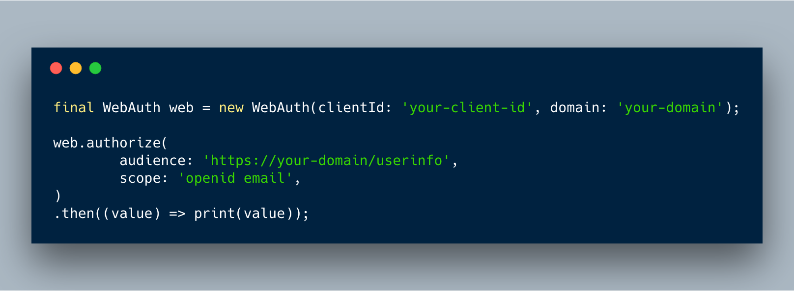
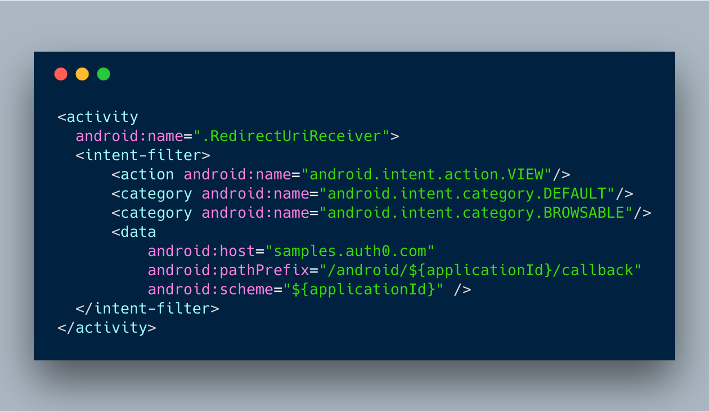
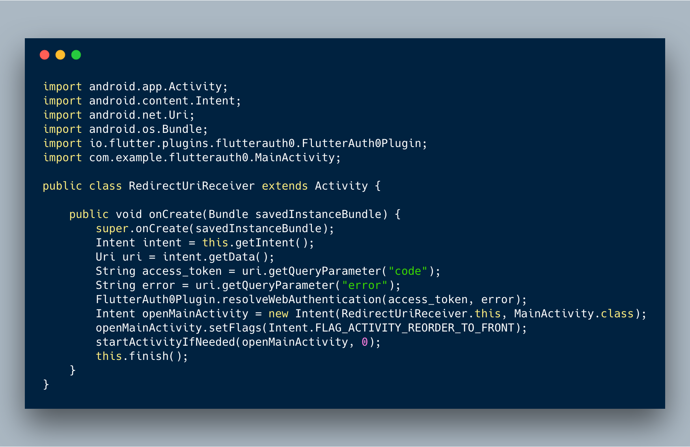
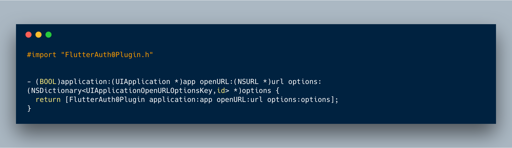

## v0.5.0 (2019-08-09)

breaking changes:

- parameter to use auth0 authentication

features:

- users handler
    - get user info
    - update user info

## v0.3.1 (2019-08-09)

fixes:

- pub.dev fixes

## v0.3.0 (2019-08-09)

fixes:

- blank login page

## v0.2.2 (2019-08-08)

fixes:

- minor fixes

## v0.2.1 (2019-01-31)

fixes:

- Expiration token in seconds.

## v0.2.0 (2019-01-30)

enhances:

- Error handler when sign-in/sign-up.

## v0.1.0 (2019-01-10)

features:

- Refresh token integrated.

enhances:

- directory layout was change.

## v0.0.2 (2018-12-03)

### Using Authorization Code flow with PKCE



### Callback URL(s)

Callback URLs are the URLs that Auth0 invokes after the authentication process. Auth0 routes your application back to this URL and appends additional parameters to it, including a token. Since callback URLs can be manipulated, you will need to add this URL to your Application's Allowed Callback URLs for security. This will enable Auth0 to recognize these URLs as valid. If omitted, authentication will not be successful.

Go to the [Auth0 Dashboard](https://manage.auth0.com/#/applications), select your application and make sure that **Allowed Callback URLs** contains the following:

#### iOS

```text
{YOUR_BUNDLE_IDENTIFIER}://${YOUR_AUTH0_DOMAIN}/ios/{YOUR_BUNDLE_IDENTIFIER}/callback
```

#### Android

```text
{YOUR_APP_PACKAGE_NAME}://{YOUR_AUTH0_DOMAIN}/android/{YOUR_APP_PACKAGE_NAME}/callback
```

### To use

#### Android

In the file `android/app/src/main/AndroidManifest.xml` you must make sure the **MainActivity** of the app has a **launchMode** value of `singleTask` and add the following activity:

So if you have `samples.auth0.com` as your Auth0 domain you would have the following **MainActivity** configuration:



Create the file **RedirectUriReceiver.java**



#### iOS

Inside the ios folder find the file AppDelegate.[swift|m] add the following to it



Inside the `ios` folder open the `Info.plist` and locate the value for `CFBundleIdentifier`, e.g.

```xml
<key>CFBundleIdentifier</key>
<string>$(PRODUCT_BUNDLE_IDENTIFIER)</string>
```

and then register a URL type entry using the value of `CFBundleIdentifier` as the value of `CFBundleURLSchemes`

```xml
<key>CFBundleURLTypes</key>
<array>
    <dict>
        <key>CFBundleTypeRole</key>
        <string>None</string>
        <key>CFBundleURLName</key>
        <string>auth0</string>
        <key>CFBundleURLSchemes</key>
        <array>
            <string>$(PRODUCT_BUNDLE_IDENTIFIER)</string>
        </array>
    </dict>
</array>
```

## v0.0.1 (2018-10-31)

A Flutter plugin to use the [Auth0 API](https://auth0.com/docs/api/authentication).

Note: This plugin is still under development, and some APIs might not be available yet. Feedback and Pull Requests are most welcome!

## Usage

To use this plugin, add `flutter_auth0` as a [dependency in your pubspec.yaml file](https://flutter.io/platform-plugins/).

## SignIn with email and password

To signin instance auth0 using `auth0-client-id` and `auth0-domain` and call signInWithEmailAndPassword function with email and password as params

```dart

final auth = new Auth0(clientId: 'your-client-id', domain: 'your-domain');

Auth0User user = await auth.passwordRealm(
        username: 'username/email',
        password: 'password',
        realm: 'Username-Password-Authentication');
```
